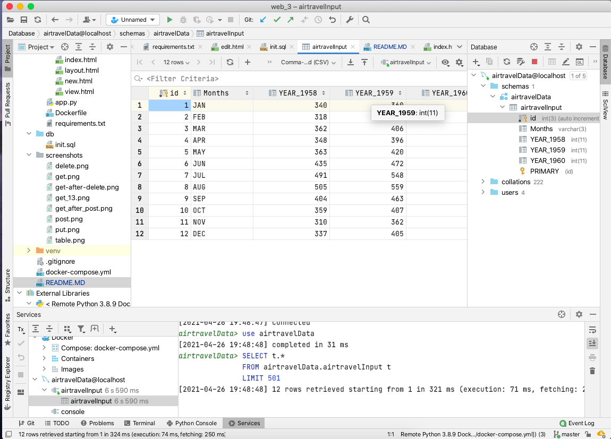
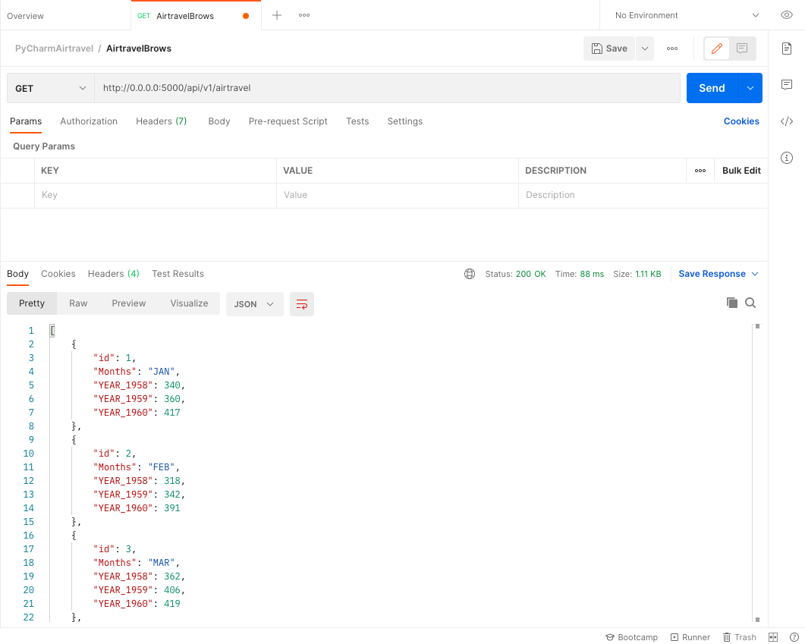
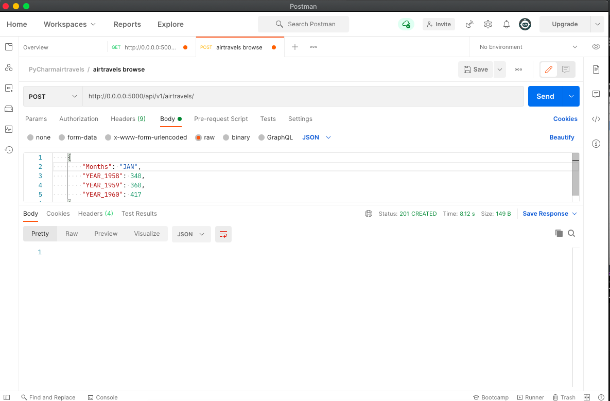
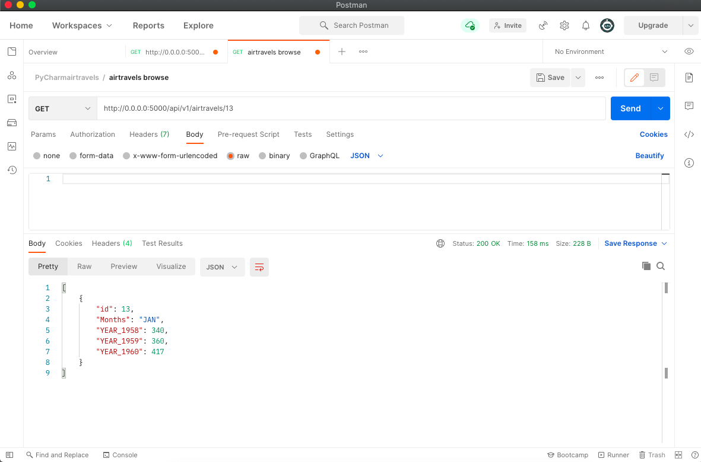
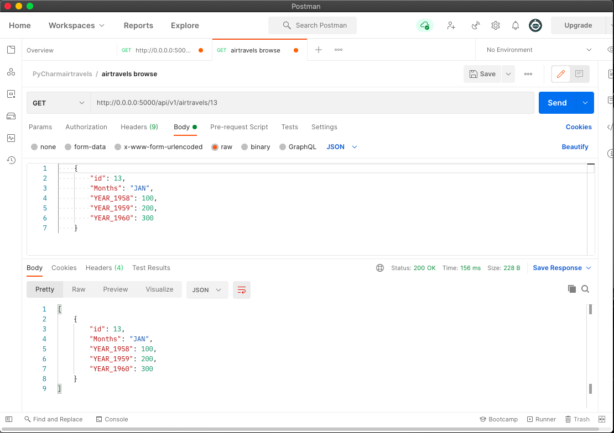
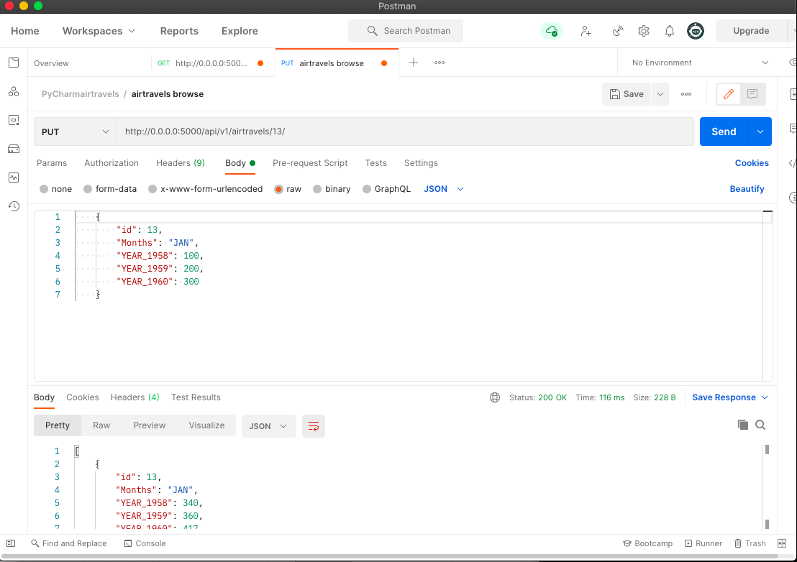
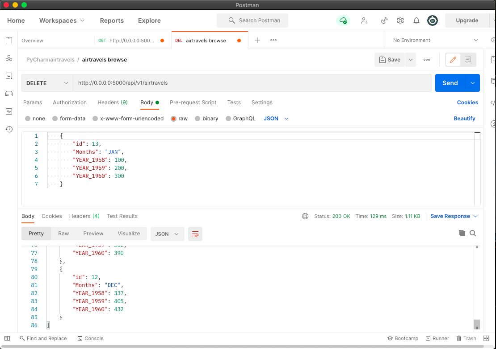
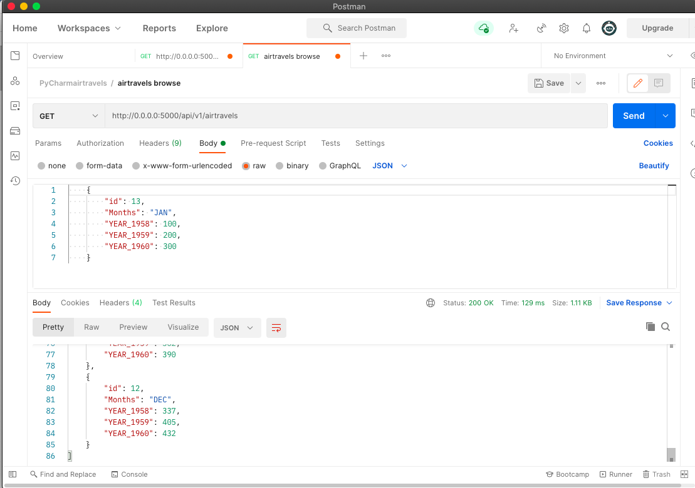

# Project Description
REST API and use Postman to test GET,POST,PUT,and DELETE requests.

# Postman Screenshot Data

# GET

# POST

# GET after POST

# GET DISPLAY FOR POST

# PUT

# DELETE

# GET AFTER DELETE
